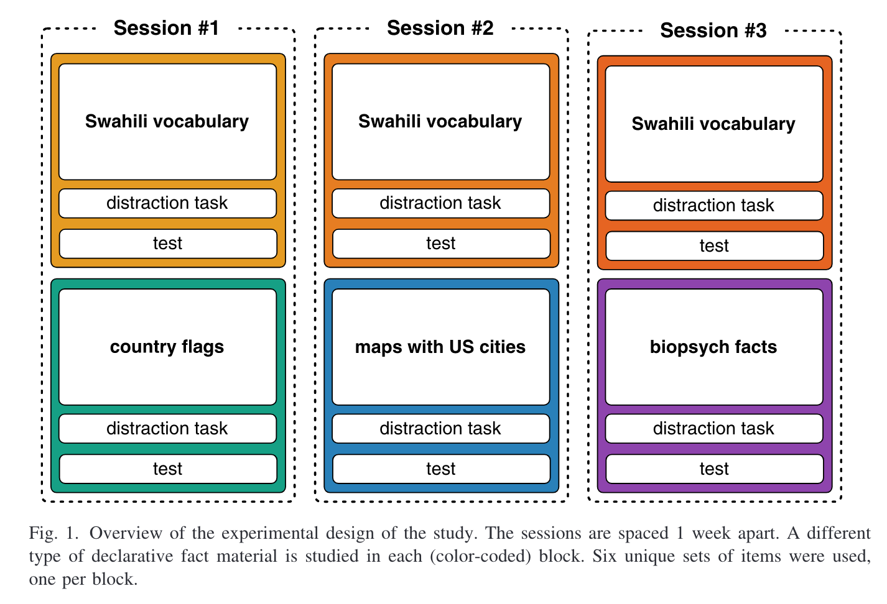

# sense2016

Practice data from the experiment reported in Sense, F., Behrens, F., Meijer, R. R., & van Rijn, H. (2016). An Individual's Rate of Forgetting Is Stable Over Time but Differs Across Materials. Topics in Cognitive Science, 8(1), 305--321. <https://doi.org/10.1111/tops.12183>

## Study design

Participants studied 75 Swahili-English word pairs, split into three sets of 25, with 1-week intervals between sets. Participants also studied other non-vocabulary materials after each of the Swahili sets: flag-country name pairs, map-city name pairs, and biopsychology definition-term pairs.

Study blocks were 20 minutes long and used the SlimStampen adaptive retrieval practice algorithm. Each study block was followed by a 5-minute distractor task and a recall test.

While learning the material of each block, novel items were presented on study trials and subsequent repetitions were presented on test trials. On a study trial, participants saw both the cue and the correct response and had to type in the correct response to proceed. On a test trial, participants only saw the cue and had to type in the correct response. Feedback ("correct"/"incorrect") was provided in both trial types and lasted 0.6 and 4 s for correct and incorrect responses, respectively. The feedback on incorrect trials always resembled a study trial and displayed both the cue and the correct response.

During the test at the end of each block, participants were provided with a list of all cues and were asked to provide their responses (in any order they preferred). There was no explicit time limit for completing the test.

## Data overview

The `data` folder contains separate data files for the practice data and the test data.

### Practice data

Practice data is stored in long format in `data/practice_data.csv`, with one row per practice trial.

#### Columns

-   subj: participant identifier
-   session: session number
-   block: identifies the subset and type of items
-   trial: trial within the session
-   time: time in seconds at the onset of the trial, when the cue appears on screen
-   item: item identifier within block
-   presentation: counts the number of presentations
-   type: trial type (study: answer is shown on screen; test: participant needs to retrieve the answer)
-   cue: text cue (e.g., a Swahili word) that appears on screen
-   answer: expected answer (e.g., the English translation)
-   response: response given by the participant
-   correct: correctness of response
-   rt : response time in seconds (measured between trial onset and the first key press of the response)

### Test data

Responses on the tests that followed the practice blocks are stored in long format in `data/test_data.csv`, with one row per item. Note that participants were provided with a list of all cues and were asked to provide their responses in any order they preferred. Test items may therefore not have been answered in the order in which they appear in the data. Test responses were also not timed.

#### Columns

-   subj: participant identifier (same as in practice data)
-   block: identifies the subset and type of items
-   item: item identifier within block
-   cue: text cue (e.g., a Swahili word) that appears on screen
-   answer: expected answer (e.g., the English translation)
-   response: response given by the participant
-   correct: correctness of response
